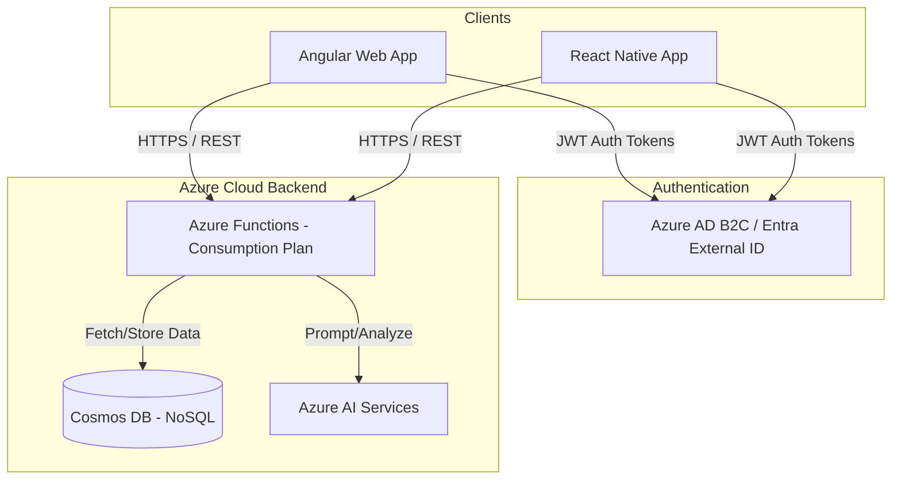

# System Architecture

This document describes the high-level system architecture of the Task Management Application, designed with cost-efficiency and Azure best practices in mind.

## High-Level Topology

## Component Details

### 1. Front-End Clients

- **Angular**: A TypeScript-based web framework that compiles to static files. It is hosted as a static web app via Azure Static Web Apps, meaning no compute costs for web server hosting. The app is built using the Nx workspace.
- **React Native**: Uses React and JavaScript/TypeScript to deliver a native mobile experience for iOS and Android.

### 2. Backend Serverless API

- **Azure Functions (C# HTTP Triggers)**: All business logic, CRUD operations, and access-control validation run entirely in serverless functions. This minimizes costs by scaling precisely to usage and billing only per execution.

### 3. Data Store

- **Azure Cosmos DB (NoSQL)**: Stores Groups, Users, and Tasks as JSON documents.
  - _Partition Strategy_: Groups will likely act as the primary partition key, allowing fast query isolation for team/family scopes.
  - _Why NoSQL?_: Rapid schema evolution and hands-on learning for modern Azure Developer certifications.

### 4. Applied AI Services

- **Azure OpenAI / Azure AI Language**: Serves two main functions:
  1.  **Tagging/Categorization**: Processing text input to automatically suggest categories or tags for tasks.
  2.  **Task Breakdown**: Using generative AI to read a complex task ("Plan summer vacation") and generate an achievable checklist.

## Security and Identity

Identity is handled via standard OAuth/OpenID Connect flows using Microsoft Entra. The frontend retrieves a token and includes it as a Bearer token to the Azure Functions. The Functions validate the token signatures and enforce Role-Based Access Control before interacting with Cosmos DB.
